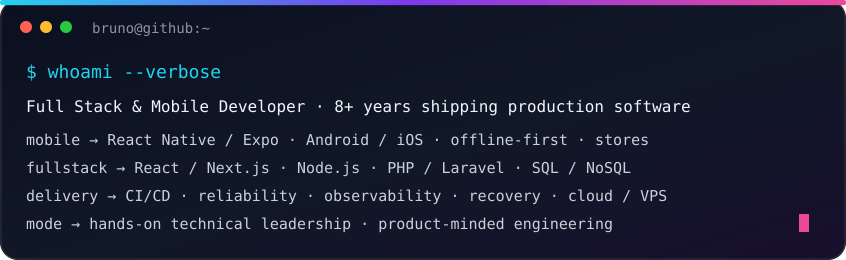
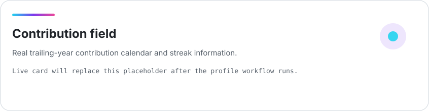
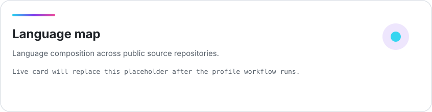
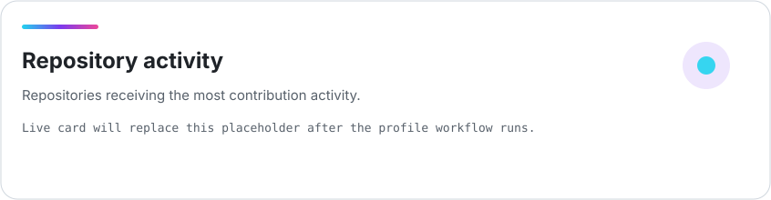

<picture>
  <source media="(prefers-color-scheme: dark)" srcset="./assets/profile-hero-dark.svg">
  <source media="(prefers-color-scheme: light)" srcset="./assets/profile-hero-light.svg">
  
</picture>

  
  
  
  
  

  

<strong>🇧🇷 Ler em português</strong>

 

Sou desenvolvedor **Full Stack & Mobile** com mais de **8 anos de experiência** construindo e evoluindo produtos web, mobile, APIs e sistemas em produção. Minha especialidade mais profunda é **engenharia mobile**, principalmente React Native/Expo, com atuação avançada também em **React/Next.js, TypeScript/Node.js e PHP/Laravel**.

Trabalho além da feature: arquitetura, dados, offline-first, multitenancy/white-label, integrações, CI/CD, confiabilidade, performance, publicação nas lojas e sustentação fazem parte do mesmo ciclo. Também atuo com **liderança técnica hands-on**, code review, mentoria e ownership de produto.

**Links rápidos:** [Portfólio](https://bmvbrun0.github.io/) · [Currículo PT-BR](https://bmvbrun0.github.io/assets/docs/curriculo-br-2026.pdf) · [LinkedIn](https://www.linkedin.com/in/bruno-getten-triches/)

  

## ⚡ Engineering lanes

<table>
<tr>
<td width="50%" valign="top">

### 📱 Mobile Engineering
React Native / Expo, Android/iOS architecture, offline-first, synchronization, native integrations, releases, store publishing and production maintenance.

</td>
<td width="50%" valign="top">

### 🌐 Full Stack & Backend
React, Next.js, TypeScript, Node.js/NestJS, PHP/Laravel, REST, WebSockets, SQL/NoSQL, caching, queues and integrations.

</td>
</tr>
<tr>
<td width="50%" valign="top">

### ⚙️ Delivery & Reliability
Docker, CI/CD, AWS/Azure/VPS, automated testing, observability, backups, rollback/recovery, load balancing and production support.

</td>
<td width="50%" valign="top">

### 🧭 Product & Technical Leadership
Architecture decisions, PR/code review, mentoring, product ownership and translating business needs into executable technical work.

</td>
</tr>
</table>

## 🎨 Core stack

  
  
  
  
  
  
  
  
  

  
  
  
  
  
  
  
  
  

<strong>🧠 Expanded engineering map</strong>

 

  
  
  
  
  
  
  
  
  
  
  
  
  
  
  
  

**Data:** PostgreSQL · SQL Server · MySQL / MariaDB · Oracle · MongoDB · Redis · Firebase · SQLite · modeling · query tuning · stored procedures · triggers · aggregations.

**Engineering:** GitHub Actions · Jenkins · GitLab CI · Playwright · Jest · RabbitMQ · Kafka · SQS/SNS · Kubernetes · LLM/OpenAI integrations.

## 🚀 Selected public builds

<table>
<tr>
<td width="50%" valign="top"></td>
<td width="50%" valign="top"></td>
</tr>
<tr>
<td width="50%" valign="top"></td>
<td width="50%" valign="top"></td>
</tr>
</table>

  <strong>More authored products, screenshots and technical context → <a href="https://bmvbrun0.github.io/library.html">Project Library</a></strong>

## 📡 Live GitHub telemetry

Generated from GitHub data by Actions and committed back into this repository. No fake counters or static sample activity.

<picture>
  <source media="(prefers-color-scheme: dark)" srcset="./assets/generated/overview.dark.svg">
  
</picture>

<picture>
  <source media="(prefers-color-scheme: dark)" srcset="./assets/generated/contributions.dark.svg">
  
</picture>

<table>
<tr>
<td width="50%" valign="top">
<picture>
  <source media="(prefers-color-scheme: dark)" srcset="./assets/generated/rhythm.dark.svg">
  
</picture>
</td>
<td width="50%" valign="top">
<picture>
  <source media="(prefers-color-scheme: dark)" srcset="./assets/generated/languages.dark.svg">
  
</picture>
</td>
</tr>
</table>

<strong>📦 Repository activity</strong>

 
<picture>
  <source media="(prefers-color-scheme: dark)" srcset="./assets/generated/repositories.dark.svg">
  
</picture>

<strong>🐍 Arcade mode — contribution snake</strong>

 

  <picture>
    <source media="(prefers-color-scheme: dark)" srcset="https://raw.githubusercontent.com/BMVBrun0/BMVBrun0/output/github-snake-dark.svg">
    <source media="(prefers-color-scheme: light)" srcset="https://raw.githubusercontent.com/BMVBrun0/BMVBrun0/output/github-snake.svg">
    
  </picture>

The snake is generated from the contribution calendar by GitHub Actions. The telemetry cards above are the primary activity view.

<strong>🤝 How I work</strong>

 

I like understanding the product, market and people using it before choosing the solution. I care about code quality, but also about **release timing, recovery plans, support workflows, store requirements, data integrity and the operational cost of software after launch**.

I work comfortably across Engineering, QA, Product, Support, Sales, customers and partners, adapting technical communication to the audience while keeping trade-offs visible.

  

