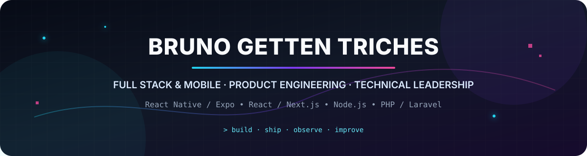
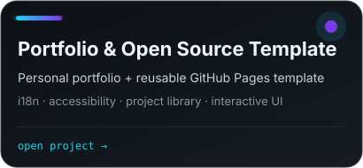
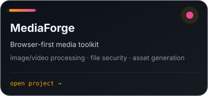
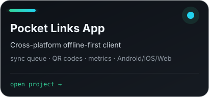
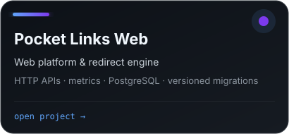

<picture>
  <source media="(prefers-color-scheme: dark)" srcset="./assets/profile-hero-dark.svg">
  <source media="(prefers-color-scheme: light)" srcset="./assets/profile-hero-light.svg">
  
</picture>

  
  
  
  
  

## About

I build production software across **mobile, web and backend**, with 8+ years working on products, APIs, data and the infrastructure around them. My deepest specialization is **mobile engineering with React Native / Expo**; on the web and backend I work extensively with **React / Next.js, TypeScript / Node.js and PHP / Laravel**.

I currently work as **Tech Lead at Sensorama Play**, leading a six-person engineering team while staying hands-on. My work has included multitenant/white-label platforms, offline synchronization, app-store delivery, data migrations, CI/CD, queues and caching, observability, load testing, deployment/recovery paths and production support.

I like owning the parts that sit between code and the real product too: understanding how customers use it, deciding when and how to release, keeping rollback paths available, and translating between Engineering, Product, QA, Support and Sales.

<strong>Português</strong>

 

Desenvolvo software em produção de ponta a ponta, atuando em **mobile, web e backend** há mais de 8 anos. Minha especialidade mais profunda é **engenharia mobile com React Native / Expo**, com atuação avançada também em **React / Next.js, TypeScript / Node.js e PHP / Laravel**.

Atualmente sou **Tech Lead na Sensorama Play**, liderando tecnicamente uma equipe de seis profissionais sem deixar de atuar diretamente no código. Minha experiência inclui plataformas multitenant/white-label, sincronização offline, publicação em lojas, migração de dados, CI/CD, filas e cache, observabilidade, testes de carga, deploy/recovery e sustentação em produção.

Também gosto da parte entre tecnologia e produto: entender como o cliente realmente usa o sistema, planejar releases, manter caminhos de rollback e fazer Engenharia, Produto, QA, Suporte e Comercial falarem a mesma língua.

## Focus

<table>
<tr>
<td width="50%" valign="top">

**Mobile engineering**

React Native / Expo, Android/iOS architecture, offline-first, synchronization, native integrations, builds, signing, store publishing and production maintenance.

</td>
<td width="50%" valign="top">

**Full stack & backend**

React, Next.js, TypeScript, Node.js/NestJS, PHP/Laravel, REST, WebSockets, SQL/NoSQL, caching, queues and integrations.

</td>
</tr>
<tr>
<td width="50%" valign="top">

**Delivery & reliability**

Docker, CI/CD, AWS/Azure/VPS, automated testing, observability, backups, rollback/recovery, load balancing and production support.

</td>
<td width="50%" valign="top">

**Technical leadership**

Architecture decisions, PR/code review, mentoring, product ownership, incident analysis and technical alignment across teams.

</td>
</tr>
</table>

## Core stack

  
  
  
  
  
  
  
  
  

  
  
  
  
  
  
  
  
  

<strong>Additional stack</strong>

 

  
  
  
  
  
  
  
  
  
  
  
  
  
  
  
  
  

**Data:** PostgreSQL · SQL Server · MySQL / MariaDB · Oracle · MongoDB · Redis · Firebase · SQLite · modeling · query tuning · stored procedures · triggers · aggregations.

**Engineering:** GitHub Actions · Jenkins · GitLab CI · Playwright · Jest · RabbitMQ · Kafka · SQS/SNS · Kubernetes · LLM/OpenAI integrations.

## Selected work

<table>
<tr>
<td width="50%" valign="top"></td>
<td width="50%" valign="top"></td>
</tr>
<tr>
<td width="50%" valign="top"></td>
<td width="50%" valign="top"></td>
</tr>
</table>

  <a href="https://bmvbrun0.github.io/library.html"><strong>More authored products, screenshots and technical context</strong></a>

## GitHub activity

Public GitHub activity only. Most company and client work is kept in private repositories.

  

  

  

<strong>Contribution animation</strong>

 

  <picture>
    <source media="(prefers-color-scheme: dark)" srcset="https://raw.githubusercontent.com/BMVBrun0/BMVBrun0/output/github-snake-dark.svg">
    <source media="(prefers-color-scheme: light)" srcset="https://raw.githubusercontent.com/BMVBrun0/BMVBrun0/output/github-snake.svg">
    
  </picture>

